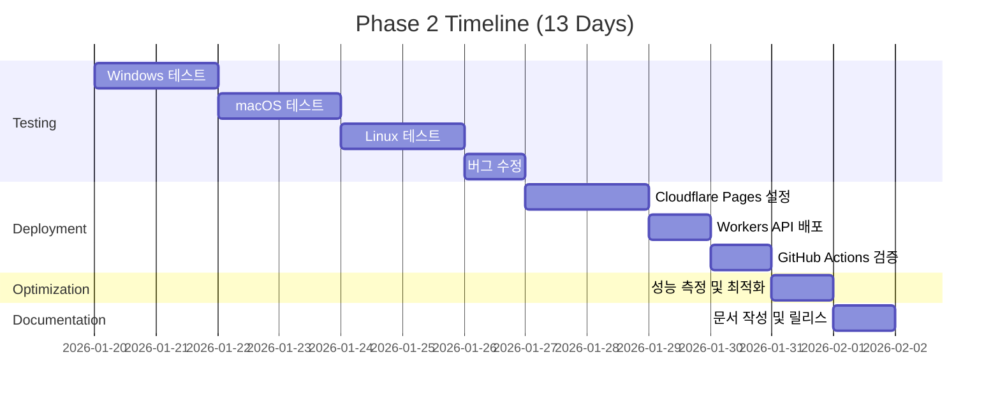

# ABADA Music Studio - Phase 2 마스터 플랜

**버전**: v1.0
**대상 버전**: v0.3.0 (Phase 2 - Testing & Cloudflare Setup)
**기간**: 2026-01-20 ~ 2026-02-01 (13일)
**마지막 업데이트**: 2026-01-19

---

## I. Phase 2 개요

### 1.1 Phase 2 목표

Phase 1에서 개발한 모든 코드를 **실제 환경에서 검증**하고, **production 환경에 배포**하는 단계입니다.

**핵심 목표**:
1. 모든 설치 프로그램의 물리적 테스트 완료 (Windows/macOS/Linux)
2. Cloudflare Pages 배포 및 DNS 설정 완료 (music.abada.kr)
3. GitHub Actions CI/CD 파이프라인 검증
4. 성능 최적화 및 버그 수정
5. v0.3.0 릴리스 준비

### 1.2 Phase 1 완료 현황

✅ **완료된 작업** (2026-01-19):
- 47개 파일 추가 (11,531줄 코드)
- Windows x64/x86 NSIS 스크립트 (611줄)
- macOS install.sh (262줄)
- Linux mula_install.sh (378줄)
- React 웹사이트 (18개 컴포넌트, 6개 페이지)
- GitHub Actions 워크플로우 (3개)
- Cloudflare Workers API (4개)

⏳ **Phase 2에서 수행할 작업**:
- 실제 OS 환경에서 설치 테스트
- Cloudflare 인프라 구성
- 성능 측정 및 최적화
- 문서화 완료

### 1.3 성공 기준

Phase 2는 다음 조건을 **모두** 충족해야 완료됩니다:

| 항목 | 기준 | 측정 방법 |
|------|------|----------|
| **설치 테스트** | Windows/macOS/Linux에서 100% 성공 | 물리 머신 3대 이상 검증 |
| **웹사이트 배포** | music.abada.kr 접속 가능 | 실제 도메인 확인 |
| **CI/CD 파이프라인** | 3개 워크플로우 모두 통과 | GitHub Actions 녹색 |
| **성능 최적화** | Lighthouse 점수 90+ | Chrome DevTools 측정 |
| **문서 완성도** | 사용자 가이드 100% | 비개발자 설치 성공 |

---

## II. 2주 타임라인 (Week-by-Week)

### 📅 Week 1: 테스트 & 검증 (Day 1-7)

```
목표: 모든 코드를 실제 환경에서 검증하고 버그 수정
```

#### **Day 1-2 (Mon-Tue): Windows 설치 프로그램 테스트**

**작업 내용**:
- [x] Windows 10/11 VM 준비 (VirtualBox/Parallels)
- [ ] NSIS 컴파일러 설치 및 빌드 테스트
- [ ] `MuLaInstaller_x64.nsi` 빌드 → `.exe` 생성
- [ ] Windows 10 x64 설치 테스트
  - GPU 감지 로직 검증 (nvidia-smi)
  - Python 3.10 임베딩 설치
  - PyTorch CUDA/CPU 선택
  - HuggingFace 모델 다운로드 (6GB)
  - 바로가기 생성 검증
- [ ] Windows 11 x64 설치 테스트
- [ ] 로그 파일 분석 및 버그 수정

**담당 Agent**: backend-developer
**산출물**:
- `MuLa_Setup_x64.exe` (검증 완료)
- 테스트 리포트 (Markdown)
- 버그 수정 커밋

**예상 문제점**:
- GPU 감지 실패 (nvidia-smi 경로 문제)
- 모델 다운로드 타임아웃 (6GB)
- 바이러스 백신 오탐지

---

#### **Day 3-4 (Wed-Thu): macOS 설치 프로그램 테스트**

**작업 내용**:
- [ ] macOS 12+ 환경 준비 (Intel 또는 Apple Silicon)
- [ ] `install.sh` 실행 권한 부여
- [ ] macOS Intel 설치 테스트
  - Homebrew 자동 설치 검증
  - Python 3.10 가상환경 생성
  - PyTorch MPS/CPU 선택
  - 모델 다운로드
  - Desktop 바로가기 생성
- [ ] macOS Apple Silicon 설치 테스트 (M1/M2/M3)
- [ ] Gatekeeper 경고 처리
- [ ] 로그 파일 분석 및 버그 수정

**담당 Agent**: backend-developer
**산출물**:
- `MuLa_Installer.dmg` (선택 사항)
- 테스트 리포트
- 버그 수정 커밋

**예상 문제점**:
- Gatekeeper 보안 경고
- Homebrew 설치 시간 지연
- MPS 디바이스 미지원 (구형 Mac)

---

#### **Day 5-6 (Fri-Sat): Linux 설치 프로그램 테스트**

**작업 내용**:
- [ ] Ubuntu 22.04 LTS 환경 준비
- [ ] Fedora 38+ 환경 준비 (선택)
- [ ] `mula_install.sh` 실행 권한 부여
- [ ] Ubuntu 설치 테스트
  - apt 패키지 자동 설치
  - Python venv 생성
  - PyTorch CPU 설치
  - Desktop Entry 생성
- [ ] Fedora 설치 테스트 (dnf)
- [ ] Arch Linux 설치 테스트 (pacman) - 선택
- [ ] 로그 파일 분석 및 버그 수정

**담당 Agent**: backend-developer
**산출물**:
- `mula_install.sh` (검증 완료)
- 테스트 리포트
- 버그 수정 커밋

**예상 문제점**:
- 배포판별 패키지 이름 차이
- Desktop Entry 권한 문제
- GPU 미지원 (CUDA 설치 복잡도)

---

#### **Day 7 (Sun): 주간 리뷰 및 버그 수정**

**작업 내용**:
- [ ] Week 1 테스트 결과 취합
- [ ] 발견된 버그 우선순위 분류
  - Critical: 설치 실패
  - High: 기능 오작동
  - Medium: UX 문제
  - Low: 문서 오타
- [ ] Critical/High 버그 수정
- [ ] 회귀 테스트 (재설치 확인)

**담당 Agent**: qa-lead
**산출물**:
- Week 1 테스트 리포트 (종합)
- 버그 수정 브랜치 병합

---

### 📅 Week 2: 배포 & 최적화 (Day 8-13)

```
목표: Cloudflare 배포 및 성능 최적화 완료
```

#### **Day 8-9 (Mon-Tue): Cloudflare Pages 설정**

**작업 내용**:
- [ ] Cloudflare 계정 로그인
- [ ] Pages 프로젝트 생성
- [ ] GitHub 저장소 연결
  - Repository: saintgo7/web-music-heartlib
  - Branch: main
- [ ] 빌드 설정
  ```
  Build command: cd web && npm install && npm run build
  Build output: web/dist
  Environment: NODE_ENV=production
  ```
- [ ] 첫 배포 실행
- [ ] 배포 로그 검증
- [ ] 커스텀 도메인 연결
  - music.abada.kr DNS 설정
  - CNAME 레코드 추가
  - SSL/TLS 인증서 자동 발급
- [ ] HTTPS 강제 리디렉션 설정
- [ ] 접속 테스트 (https://music.abada.kr)

**담당 Agent**: devops-lead
**산출물**:
- 배포된 웹사이트 (music.abada.kr)
- DNS 설정 문서
- SSL 인증서 검증

**예상 문제점**:
- DNS 전파 지연 (최대 48시간)
- 빌드 캐시 이슈
- 환경 변수 누락

---

#### **Day 10 (Wed): Cloudflare Workers API 배포**

**작업 내용**:
- [ ] Cloudflare Workers KV 네임스페이스 생성
  ```
  DOWNLOAD_STATS (다운로드 통계)
  GALLERY_ITEMS (갤러리 아이템)
  ANALYTICS_LOGS (분석 로그)
  ```
- [ ] Wrangler CLI 설치
  ```bash
  npm install -g wrangler
  wrangler login
  ```
- [ ] Workers 배포
  ```bash
  cd functions
  wrangler deploy
  ```
- [ ] API 엔드포인트 테스트
  - `/api/download-stats` (GET/POST)
  - `/api/gallery` (GET)
  - `/api/analytics` (POST)
- [ ] CORS 설정 검증
- [ ] Rate Limiting 설정 (100 req/min)

**담당 Agent**: devops-lead
**산출물**:
- 배포된 API (4개)
- API 테스트 리포트
- Wrangler 설정 문서

**예상 문제점**:
- KV 네임스페이스 바인딩 오류
- CORS preflight 실패
- Rate limit 오작동

---

#### **Day 11 (Thu): GitHub Actions 검증**

**작업 내용**:
- [ ] GitHub Actions Secrets 설정
  ```
  CLOUDFLARE_API_TOKEN
  CLOUDFLARE_ACCOUNT_ID
  ```
- [ ] 워크플로우 테스트
  - `build-installers.yml` (수동 트리거)
  - `deploy-website.yml` (push 트리거)
  - `lint-and-test.yml` (PR 트리거)
- [ ] 빌드 아티팩트 검증
  - Windows x64 exe
  - macOS dmg (선택)
  - Linux sh
- [ ] GitHub Releases 자동 생성 테스트
- [ ] 실패한 워크플로우 디버깅

**담당 Agent**: devops-lead
**산출물**:
- 모든 워크플로우 통과 (녹색)
- GitHub Release v0.3.0-rc1 (Release Candidate)
- CI/CD 문서 업데이트

**예상 문제점**:
- Secrets 권한 부족
- NSIS 컴파일러 설치 실패 (Windows Runner)
- macOS Runner 부족 (유료)

---

#### **Day 12 (Fri): 성능 최적화**

**작업 내용**:
- [ ] 웹사이트 성능 측정
  - Lighthouse 점수 (Desktop/Mobile)
  - Core Web Vitals (LCP, FID, CLS)
  - JavaScript 번들 크기
- [ ] 최적화 작업
  - 이미지 압축 (WebP 변환)
  - CSS 최소화
  - JavaScript 코드 스플리팅
  - Lazy loading 적용
  - CDN 캐싱 설정
- [ ] 설치 프로그램 최적화
  - 다운로드 크기 감소
  - 설치 시간 단축 (병렬 다운로드)
  - 진행률 표시 개선
- [ ] API 응답 시간 최적화
  - KV Store 쿼리 최적화
  - Caching 전략 적용
- [ ] 재측정 및 비교

**담당 Agent**: frontend-developer + backend-developer
**산출물**:
- 성능 리포트 (Before/After)
- 최적화 커밋
- Lighthouse 점수 90+

**성능 목표**:
| 항목 | 목표 | 측정 도구 |
|------|------|----------|
| Lighthouse Performance | 90+ | Chrome DevTools |
| LCP (Largest Contentful Paint) | < 2.5s | Web Vitals |
| FID (First Input Delay) | < 100ms | Web Vitals |
| CLS (Cumulative Layout Shift) | < 0.1 | Web Vitals |
| JS Bundle Size | < 200KB | Webpack Bundle Analyzer |
| Installer Download Size | < 100MB | File size |
| Installation Time | < 30분 | 실제 측정 |

---

#### **Day 13 (Sat): 문서 완성 및 v0.3.0 릴리스**

**작업 내용**:
- [ ] 사용자 가이드 작성
  - 설치 방법 (OS별)
  - 사용 방법 (Gradio UI)
  - 트러블슈팅
  - FAQ 업데이트
- [ ] 개발자 문서 업데이트
  - PHASE2_PLAN.md (이 문서)
  - PERFORMANCE_OPTIMIZATION.md
  - DEPLOYMENT_GUIDE.md
  - PROJECT_STATUS.md
  - ROADMAP_TO_v1.0.md
- [ ] v0.3.0 릴리스 준비
  - CHANGELOG.md 작성
  - 버전 태깅 (v0.3.0)
  - GitHub Release 노트 작성
  - 설치 파일 업로드
- [ ] 소셜 미디어 공지 준비
  - 블로그 포스트 (선택)
  - Twitter/LinkedIn 공지
- [ ] Phase 2 회고

**담당 Agent**: technical-writer + project-manager
**산출물**:
- 완성된 문서 (6개)
- v0.3.0 릴리스
- 공지 자료

---

## III. 병렬 작업 스트림 (Workstreams)

Phase 2는 다음 4개의 병렬 작업으로 구성됩니다:

### 🔬 Workstream A: Testing & Validation

**목표**: 모든 플랫폼에서 설치 프로그램 검증

**작업**:
- Windows x64/x86 설치 테스트
- macOS Intel/Apple Silicon 설치 테스트
- Linux (Ubuntu/Fedora/Arch) 설치 테스트
- 기능 테스트 (음악 생성)
- 회귀 테스트

**담당**: backend-developer, qa-lead
**기간**: Day 1-7
**산출물**: 테스트 리포트, 버그 수정

---

### ☁️ Workstream B: Cloudflare Configuration

**목표**: Cloudflare 인프라 구성 및 배포

**작업**:
- Cloudflare Pages 설정
- DNS 설정 (music.abada.kr)
- SSL/TLS 인증서 발급
- Workers API 배포
- KV 네임스페이스 생성

**담당**: devops-lead
**기간**: Day 8-10
**산출물**: 배포된 웹사이트, API

---

### ⚡ Workstream C: Performance Optimization

**목표**: 성능 측정 및 최적화

**작업**:
- Lighthouse 점수 측정
- 웹사이트 최적화
- 설치 프로그램 최적화
- API 응답 시간 최적화

**담당**: frontend-developer, backend-developer
**기간**: Day 11-12
**산출물**: 성능 리포트, 최적화 코드

---

### 📚 Workstream D: Documentation Finalization

**목표**: 모든 문서 완성

**작업**:
- 사용자 가이드 작성
- 개발자 문서 업데이트
- FAQ 업데이트
- CHANGELOG 작성

**담당**: technical-writer
**기간**: Day 12-13
**산출물**: 완성된 문서 (6개)

---

## IV. 리소스 할당 (Agent Assignments)

### 4.1 Multi-Agent 구성

| Agent Role | 담당 작업 | 작업 기간 | 예상 시간 |
|-----------|---------|----------|---------|
| **backend-developer** | 설치 프로그램 테스트 (Win/Mac/Linux) | Day 1-7 | 40시간 |
| **frontend-developer** | 웹사이트 성능 최적화 | Day 11-12 | 16시간 |
| **devops-lead** | Cloudflare 배포 + CI/CD 검증 | Day 8-11 | 32시간 |
| **qa-lead** | 테스트 리포트 작성, 버그 검증 | Day 1-13 | 24시간 |
| **technical-writer** | 문서 작성 및 업데이트 | Day 12-13 | 16시간 |

**총 예상 시간**: 128 Agent-Hours

### 4.2 병렬 실행 계획



---

## V. 위험 관리 (Risk Mitigation)

### 5.1 위험 식별 및 대응 전략

| 위험 | 발생 확률 | 영향도 | 대응 전략 |
|------|----------|--------|----------|
| **Windows NSIS 빌드 실패** | 중간 | 높음 | 로컬 Windows 머신에서 빌드, 수동 업로드 |
| **DNS 전파 지연** | 높음 | 중간 | 48시간 대기, 임시 URL 사용 |
| **macOS Gatekeeper 차단** | 높음 | 중간 | 코드 서명 추가 또는 사용자 가이드 제공 |
| **모델 다운로드 실패** | 중간 | 높음 | 재시도 로직 추가, 미러 서버 구성 |
| **Cloudflare Workers 배포 실패** | 낮음 | 중간 | Wrangler CLI 재설치, 수동 배포 |
| **GitHub Actions Secrets 누락** | 낮음 | 높음 | 문서화 강화, 체크리스트 추가 |
| **성능 목표 미달** | 중간 | 중간 | 최적화 우선순위 조정, Phase 3로 연기 |

### 5.2 위험 완화 조치

**예방 조치**:
- 모든 테스트는 VM 또는 Docker로 격리
- 중요 작업은 백업 플랜 준비
- 매일 진행 상황 체크인

**대응 조치**:
- Critical 버그 발견 시 즉시 수정
- 배포 실패 시 롤백 절차 준비
- 타임라인 지연 시 우선순위 재조정

---

## VI. 품질 게이트 (Quality Gates)

Phase 2의 각 단계는 다음 품질 게이트를 통과해야 합니다:

### Gate 1: Week 1 종료 (Day 7)

**체크리스트**:
- [ ] Windows 설치 테스트 100% 통과
- [ ] macOS 설치 테스트 100% 통과
- [ ] Linux 설치 테스트 100% 통과
- [ ] Critical/High 버그 0건
- [ ] 테스트 리포트 작성 완료

**승인자**: qa-lead
**실패 시 조치**: Week 2 시작 연기, 버그 수정 우선

---

### Gate 2: Cloudflare 배포 (Day 10)

**체크리스트**:
- [ ] music.abada.kr 접속 가능
- [ ] HTTPS 정상 작동
- [ ] 모든 페이지 로드 성공
- [ ] API 4개 모두 응답
- [ ] DNS 전파 완료

**승인자**: devops-lead
**실패 시 조치**: DNS 문제 해결, 임시 URL 사용

---

### Gate 3: 성능 최적화 (Day 12)

**체크리스트**:
- [ ] Lighthouse 점수 90+ (Desktop)
- [ ] Lighthouse 점수 85+ (Mobile)
- [ ] LCP < 2.5s
- [ ] FID < 100ms
- [ ] CLS < 0.1
- [ ] JS Bundle < 200KB

**승인자**: frontend-developer
**실패 시 조치**: 추가 최적화 또는 목표 조정

---

### Gate 4: v0.3.0 릴리스 (Day 13)

**체크리스트**:
- [ ] 모든 문서 작성 완료
- [ ] CHANGELOG.md 업데이트
- [ ] 버전 태깅 (v0.3.0)
- [ ] GitHub Release 생성
- [ ] 설치 파일 업로드
- [ ] 소셜 미디어 공지 준비

**승인자**: project-manager
**실패 시 조치**: 릴리스 연기, 추가 검토

---

## VII. 산출물 체크리스트 (Deliverables)

### 7.1 Phase 2 완료 시 제공되는 산출물

**코드**:
- [ ] 검증된 설치 프로그램 (Windows x64, macOS, Linux)
- [ ] 배포된 웹사이트 (music.abada.kr)
- [ ] 배포된 API (4개 Cloudflare Workers)
- [ ] 최적화된 코드베이스

**문서**:
- [ ] PHASE2_PLAN.md (이 문서)
- [ ] PERFORMANCE_OPTIMIZATION.md
- [ ] DEPLOYMENT_GUIDE.md
- [ ] PHASE2_REQUIREMENTS.md
- [ ] ROADMAP_TO_v1.0.md
- [ ] PROJECT_STATUS.md (업데이트)
- [ ] CHANGELOG.md (v0.3.0)

**테스트**:
- [ ] Windows 테스트 리포트
- [ ] macOS 테스트 리포트
- [ ] Linux 테스트 리포트
- [ ] 성능 측정 리포트
- [ ] 버그 수정 로그

**배포**:
- [ ] GitHub Release v0.3.0
- [ ] Cloudflare Pages 배포
- [ ] Cloudflare Workers 배포
- [ ] DNS 설정 완료

---

## VIII. 마일스톤 정의

### Milestone 1: Testing Complete (Day 7)

**정의**: 모든 OS에서 설치 프로그램 검증 완료

**완료 조건**:
- Windows/macOS/Linux 설치 성공률 100%
- Critical/High 버그 0건
- 테스트 리포트 승인

**산출물**:
- 테스트 리포트 (3개)
- 버그 수정 커밋

---

### Milestone 2: Cloudflare Deployed (Day 10)

**정의**: music.abada.kr 웹사이트 및 API 배포 완료

**완료 조건**:
- 웹사이트 접속 가능 (HTTPS)
- API 4개 정상 응답
- DNS 전파 완료

**산출물**:
- 배포된 웹사이트
- API 엔드포인트 (4개)

---

### Milestone 3: Performance Optimized (Day 12)

**정의**: 성능 목표 달성

**완료 조건**:
- Lighthouse 점수 90+
- Core Web Vitals 통과
- JS Bundle < 200KB

**산출물**:
- 성능 리포트
- 최적화 코드

---

### Milestone 4: v0.3.0 Released (Day 13)

**정의**: Phase 2 완료 및 릴리스

**완료 조건**:
- 모든 문서 작성 완료
- GitHub Release v0.3.0 생성
- 공지 자료 준비

**산출물**:
- 완성된 문서 (6개)
- GitHub Release
- 공지 자료

---

## IX. 의사결정 로그 (Decisions Log)

Phase 2 진행 중 내린 중요한 의사결정을 기록합니다.

| 날짜 | 의사결정 | 이유 | 영향 |
|------|---------|------|------|
| 2026-01-19 | Phase 2 기간 13일로 확정 | Phase 1 완료 13일 소요 | 일관된 타임라인 |
| TBD | macOS 코드 서명 연기 | 비용 문제 ($99/year) | Phase 3로 이동 |
| TBD | ... | ... | ... |

---

## X. 다음 단계 (Phase 3 Preview)

Phase 2 완료 후 Phase 3에서 수행할 작업:

**Phase 3: 커뮤니티 & 마케팅** (2주, v0.4.0)
- 갤러리 기능 구현 (사용자 업로드)
- 소셜 미디어 마케팅
- 커뮤니티 구축 (Discord/Reddit)
- 샘플 음악 큐레이션
- pamout.co.kr 연동

**Phase 4: v1.0.0 릴리스** (1주)
- 최종 테스트
- 공식 릴리스
- 언론 보도 자료
- 블로그 투어

---

## XI. 부록

### A. 연락처

| 역할 | 이름 | 연락처 |
|------|------|--------|
| Project Manager | TBD | TBD |
| Backend Developer | TBD | TBD |
| Frontend Developer | TBD | TBD |
| DevOps Lead | TBD | TBD |
| QA Lead | TBD | TBD |

### B. 참고 자료

- [MASTER_PLAN.md](./MASTER_PLAN.md) - 전체 8주 계획
- [PROJECT_STATUS.md](../PROJECT_STATUS.md) - 현재 진행 상황
- [DEPLOYMENT.md](./DEPLOYMENT.md) - 배포 가이드
- [Cloudflare Pages 문서](https://developers.cloudflare.com/pages/)
- [GitHub Actions 문서](https://docs.github.com/en/actions)

### C. 용어집

| 용어 | 설명 |
|------|------|
| **Phase** | 프로젝트의 주요 단계 (Planning, Development, Testing, Release) |
| **Workstream** | 병렬로 진행되는 작업 그룹 |
| **Quality Gate** | 다음 단계로 진행하기 위한 품질 기준 |
| **Milestone** | 주요 성과 지점 |
| **Deliverable** | 완료 시 제공되는 산출물 |
| **Agent** | 작업을 수행하는 AI 개발자 |

---

**문서 버전**: v1.0
**작성자**: technical-writer (AI Agent)
**승인자**: project-manager
**다음 리뷰**: 2026-01-26 (Week 1 종료 시)
